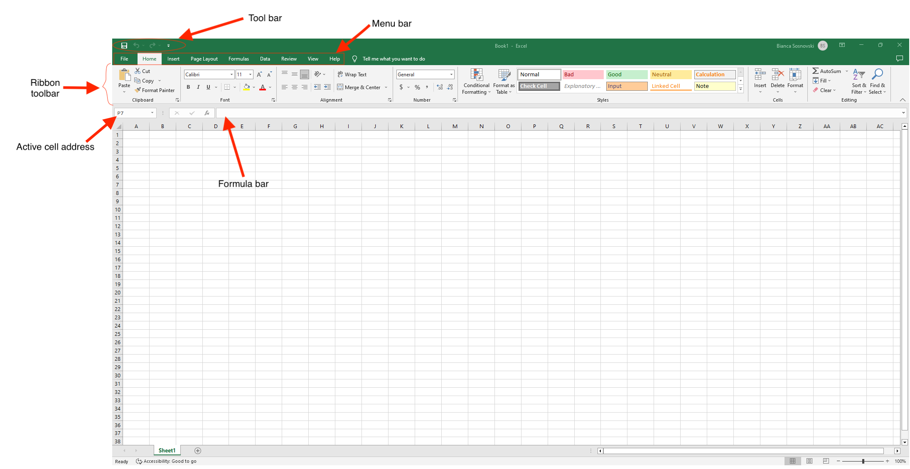
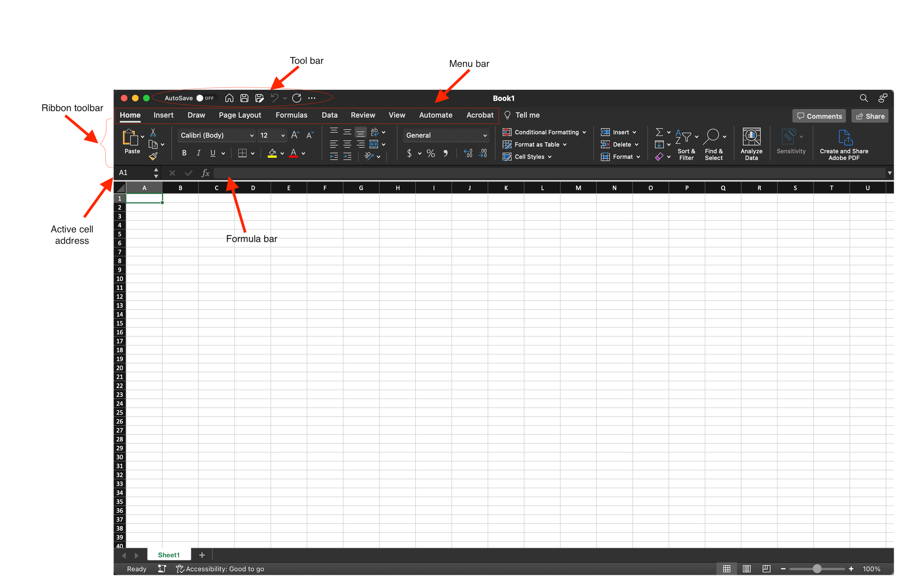
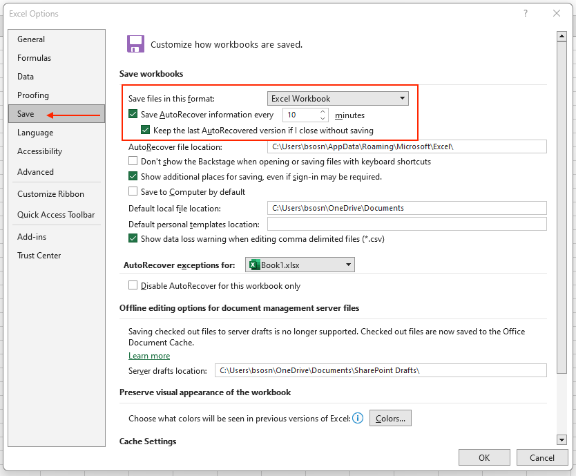
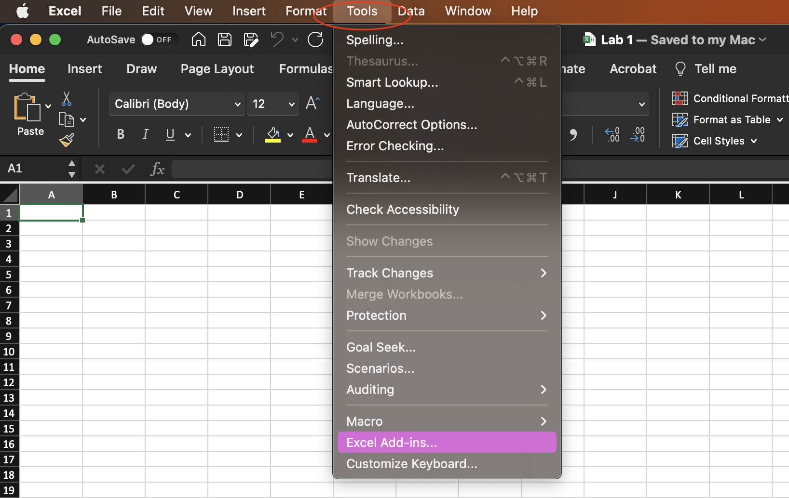
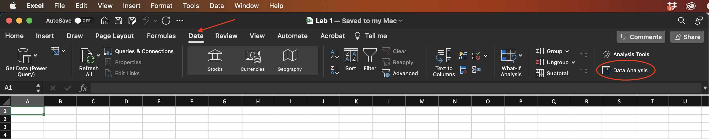
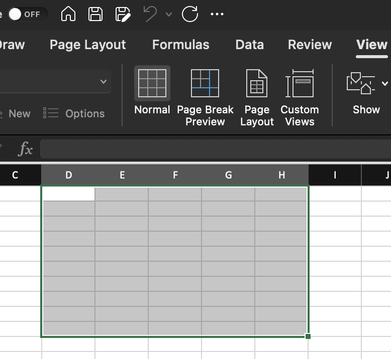

# Getting Started with Excel {#start}

City University of New York (CUNY) Students can access Excel via Microsoft 365. On most campuses, students can also remotely access a computer lab at their specific campus.

If obtaining Excel via Microsoft 365, download the software to your machine. Do not run Excel from the cloud. Running it from the cloud does not give students access to the *Analysis ToolPak* (see *Section* ***\@ref(toolpak)***).

## The Excel Window

Note that in the Excel Windows shown in Figures **\@ref(fig:window-pc)** and **\@ref(fig:window-mac)**, the title bar shows `Book1` as a temporary name for the file. When opening a new Excel file (also called a Workbook, see *Section* ***\@ref(workbook)***), it has a suggested temporary name, `Book1`, `Book2`, etc, depending on how many new files are open before saving them. When saying it for the first, Excel will prompt the user to rename it.

### The Excel Window on a PC
```{r window-pc, echo=FALSE, fig.align = 'center', out.width='100%', fig.show='hold', fig.cap='Excel Window on a PC.', fig.alt = 'Excel Window as shown on a PC.'}

```

### The Excel Window on a MAC

```{r window-mac, echo=FALSE, fig.align = 'center', out.width='100%', fig.show='hold', fig.cap='Excel Window on a MAC (in Dark Mode).', fig.alt = 'Excel Window as shown on a MAC.'}

```

## Saving Excel Files

On the main menu, click `File > Save As` when saving for the first time. A dialog  will appear, similar to the one in figure **\@ref(fig:saving-dialog-box-pc)** on a PC or figure **\@ref(fig:saving-dialog-box-mac)** on a MAC. Fill in the file name, select the directory of your choice where the file will be saved on your machine, and the file type, for example, file with extensions `.xlsx` or `.xls`. 


```{r saving-dialog-box-pc, echo=FALSE, fig.align = 'center', out.width='45%', fig.show='hold', fig.cap='Dialog window when saving a workbook on a PC.', fig.alt = 'A dialog box on a PC showing where to enter file name, select the directory and file type.'}

```

```{r saving-dialog-box-mac, echo=FALSE, fig.align = 'center', out.width='60%', fig.show='hold', fig.cap='Dialog window when saving a workbook on a MAC.', fig.alt = 'A dialog box on a MAC showing where to enter file name, select the directory and file type.'}

```
After using the `Save As` feature, you can use the `Save` command to overwrite your previously saved file with the file in its current state.  After saving the Excel file for the first time, you can save the updates during your working session using the save button on the title toolbar.

```{r saving-options, echo=FALSE, fig.align = 'center', out.width='85%', fig.show='hold', fig.cap='Saving options.', fig.alt = 'A screenshot displaying saving options in Excel.'}

```

It is essential to save your Excel files whenever you start a new project or periodically when you make changes to an existing file. Saving early and often can prevent your work from being lost. You'll also need to pay close attention to where you save the workbook so it will be easy to find later.

You can also turn on the *AutoSave* feature to save your data automatically while working on Excel. The following are the steps to turn on Auto-save.
 
### AutoSave on a PC

1. Click the `File` tab.
2. Click on `Options`.
3. In the Options dialog window, click on the `Save` option on the left.
4. Check the option `Save AutoRecover information every`. By default, the value is 10 minutes, but you can choose a lower or higher value.
5. Then click `Ok`.

```{r autosave-pc, echo=FALSE, fig.align = 'center', out.width='85%', fig.show='hold', fig.cap='AutoSave option on PC.', fig.alt = 'Excel AutoSave option on PC.'}

```

### AutoSave on a Mac

1. On the Excel title bar, click `Preferences`.
2. Under the category `Sharing and Privacy`, click `Save`.
3. Select the `AutoSave` or `AutoRecover` info in every check window, and then enter how frequently you want to save the Excel files.

```{r autosave-mac1a, echo=FALSE, fig.align = 'center', out.width='45%', fig.show='hold', fig.cap='Dropdown menu in the Excel title bar.', fig.alt = 'A screenshot showing the Preferences in Excel.'}

```


```{r autosave-mac1b, echo=FALSE, fig.align = 'center', out.width='55%', fig.show='hold', fig.cap='Save option in Excel Preferences', fig.alt = 'A screenshot showing the Save options in Excel.'}

```

A shortcut is available on Mac to activate the AutoSave. You can just toggle `ON` the `AutoSave` option in the Toolbar of the program.

```{r autosave-mac2, echo=FALSE, fig.align = 'center', out.width='50%', fig.show='hold', fig.cap='AutoSave option in the Toolbar.', fig.alt = 'A screenshot showing the AutoSave option in the Toolbar of Excel.'}

```

**Note:** AutoSave in Excel is a special feature for Microsoft 365 subscription accounts. When you save your Excel spreadsheet online on OneDrive or SharePoint, Excel activates the AutoSave feature. AutoSave in Excel saves your progress every few seconds so that all changes appear online if someone else is working on the same file.

## Opening an Excel File

To open an Excel file, go to the main menu and click `File > Open`. Select the directory containing the file, then select the file you want to open.

Note: On PCs, you will get the Enable Editing warning when you open an Excel document downloaded from the Internet for the first time. You must click the Enable Editing button to modify and work on it.

```{r enable-editing, echo=FALSE, fig.align = 'center', out.width='90%', fig.show='hold', fig.cap='Enable Editing warning.', fig.alt = 'A screenshot of the warning about the Enable Editing.'}

```
 
If you are working on your own computer, you can change Excel so that editing is enabled by default. Click File > Options >Trust Center > Trust Center Setting > Protected View. You can then uncheck the options you want related to Enable Protected View.


## The Analysis ToolPak {#toolpak}

You may need to install the *Analysis ToolPak* from the original Excel software if your computer does not have it. 

### Adding the Analysis ToolPak on a PC

With an Excel worksheet open:

1. Click on `File` in the main menu.
2. Click on `Options`.
3. Click `Add-ins` (left side menu) to see if the ToolPak is listed in the Active Application Add-ins. If it is, the ToolPak is installed. If you do not see a listing for Analysis ToolPak in Active Application Add-ins, it may be under the list of inactive applications. IYou must install it from the original Excel installation source if you do not see it.
4. To install or activate it, click `Go`.
5. Check the box next to `Analysis ToolPak`.
6. Click `OK`.

```{r analysis-toolpak-pc1, echo=FALSE, fig.align = 'center', out.width='75%', fig.show='hold', fig.cap= 'Excel Options on a PC.', fig.alt = 'A dialog box showing Excel Options on a PC.'}

```
```{r analysis-toolpak-pc2, echo=FALSE, fig.align = 'center', out.width='35%', fig.show='hold', fig.cap='Add-ins Options on a PC.', fig.alt = 'Dialog box showing Add-ins Options on a PC.'}

```

### Adding the Analysis ToolPak on a Mac

With an Excel worksheet open:

1. Click on `Tools` in the main menu.
2. Click on `Add-ins` and see if the `Analysis ToolPak` is listed as an active application. If it is not, check the box next to it.
3. Click `OK`.

```{r analysis-toolpak-mac1, echo=FALSE, fig.align = 'center', out.width='75%', fig.show='hold', fig.cap='Excel Tools on a MAC.', fig.alt = 'A dialog box showing Excel Tools on a MAC.'}

```
```{r analysis-toolpak-mac2, echo=FALSE, fig.align = 'center', out.width='40%', fig.show='hold', fig.cap='Add-ins Options on a MAC.', fig.alt = 'A dialog box showing Add-ins Options on a MAC.'}

```


## Checking if the Analysis ToolPak is Active
1.	Click on the tab `Data`.
2.	You should be able to see it as a ribbon on the top right of your Excel Window.

```{r check-toolpak-mac, echo=FALSE, fig.align = 'center', out.width='90%', fig.show='hold', fig.cap='Data tab and Analysis ToolPak ribbon.', fig.alt = 'Excel Window with highlighted Data tab and Analysis ToolPak ribbon.'}

```


## The Excel Workbook {#workbook}

The workbook is an Excel file that consists of one or more worksheets. The tabs near the bottom of the screen show that we are working with Sheet 1 (check Figures **\@ref(fig:window-pc)** and **\@ref(fig:window-mac)**) . To change worksheets, click on the corresponding worksheet tab. Alternatively, you can `RIGHT-click` (or `Control + click`) the arrows just to the left of the worksheet tabs to get a list of all the worksheets in the projects and select a worksheet.

### The Cells in the Worksheet

When you look at a worksheet, you should see horizontal and vertical grid lines. Grid lines are light grey lines that appear around cells on Microsoft Excel worksheets. If they are missing, you will need to activate that feature. To do so, see lines:

1. Select the `View` tab.
2. Click the `Show` group on the tab.
3. Be sure that the `Gridlines` option is checked or selected.

```{r gridlines-mac, echo=FALSE, fig.align = 'center', out.width='60%', fig.show='hold', fig.cap='Gridlines option in the View tab.', fig.alt = 'A screenshot showing the View tab with the Gridlines option.'}
knitr::include_graphics('images/gridlines-mac.png')
```

### Cell Addresses

Intersecting rows and columns form the cells. A cell’s address consists of a column letter followed by a row number. For example, address B3 designates the cell in Column B, Row 3. When Cell B3 is highlighted, it is the active cell, which means we can enter text or numbers into Cell B3.

### Selecting Cells

To select a cell, position the cursor in the cell and click the left mouse button (or click on your computer's trackpad). Sometimes you will want to select several cells simultaneously to format them (as described next). 

To select a rectangular block of cells, position the cursor in a corner cell, hold down the left mouse button, drag the cursor to the cell in the opposite corner of the block, and release the button.

```{r cell-sellection, echo=FALSE, fig.align = 'center', out.width='40%', fig.show='hold', fig.cap='A block of cells selected in the worksheet.', fig.alt = 'A screenshot of a block of selected cells.'}

```

To select an entire column, click on the letter above the column to be selected; to select an entire row, click on the number to its left. 

To select every cell in the worksheet, click on the blank gray rectangle in the upper left corner of the worksheet (above row header 1 and left of column header A).

You can also select a block of cells by typing the two corner cells into the active cell address window. For example, typing B3:E4 and pressing `Enter` would select the rectangular block of cells from B3 to the opposite corner E4.

### Formatting Cell Contents

In Excel, you may place text or numbers in a cell. As in other Windows applications, you can format the text or numbers by using the formatting toolbar buttons for bold (B), italics (I), underline (U), etc. Other options include left, right, and centered alignment within a cell.

```{r text-formatting, echo=FALSE, fig.align = 'center', out.width='40%', fig.show='hold', fig.cap='Text Formatting ribbon in the Home tab.', fig.alt = 'A screenshot of Text Formatting ribbon in the Home tab.'}
knitr::include_graphics('images/text-formatting.png')
```

Numbers can be formatted to represent dollar amounts ($) or percent form (%) and can be shown with commas in large numbers (,). The number of decimal places to which numbers are carried is also adjustable. All these options appear on the formatting menu bar. Other options are accessible by `RIGHT-clicking` on a cell and selecting Format Cells.

```{r number-formatting, echo=FALSE, fig.align = 'center', out.width='40%', fig.show='hold', fig.cap='Number Formatting ribbon in the Home tab.', fig.alt = 'A screenshot of Number Formatting ribbon in the Home tab.'}
knitr::include_graphics('images/number-formatting.png')
```

### Changing Cell Width

Column widths and row heights can be adjusted by placing the cursor between two columns' letters or row numbers. Hold the left mouse button down when the cursor changes appearance, move the column or row boundary, and release.
All these instructions may seem a little mysterious, but once you try them, you will find that they are fairly easy to remember.

## Entering Data

In Excel, we enter data and labels in the cells. It is common to select a column for the data and place a label as the first entry of the column.


### Entering and Correcting Data
To select a cell for content entry, move the mouse pointer to the cell and click. Then type the label or data and press Enter. Excel automatically moves to select the next cell in the same column. If you want to enter information in a different cell, click on it.

Errors are easily fixed. If you notice a mistake before you press Enter, back-arrow to the mistake and correct it. If you see the error after you have pressed Enter, select the affected cell, and then click on the formula bar to add a typing cursor to the cell contents displayed. Use standard keyboard editing techniques to make corrections, then press `Enter`.

If you want to erase the contents of a cell or range of cells but keep the formatting:

1. 	Select the cells and click `Home`
2. 	Click the arrow next to `Clear`
3. 	Select `Clear Content` (or press `Delete`)

The `Clear > Clear Formats` option keeps the content but clears the format. The ` Clear > Clear All` option removes both content and format.

**Note:** `Clear > Formats` is handy for changing percent data back into decimal format.

### Practice 1

The number of ads and the time devoted to ads were recorded for every twenty hours of prime-time viewing. Enter the data as shown in Figure **\@ref(fig:entering-data)** in your Excel workbook.

```{r entering-data, echo=FALSE, fig.align = 'center', out.width='35%', fig.show='hold', fig.cap='Excel worksheet with data.', fig.alt = 'Excel worksheet with some data typed in.'}

```

## Arithmetic Options on the Standard Toolbar

### Sum Function
 
On the `Formula` Menu, the button you see in Figure **\@ref(fig:autosum)** automatically sums the values in the selected cells. 


```{r autosum, echo=FALSE, fig.align = 'center', out.width='10%', fig.show='hold', fig.cap='Autosum button.', fig.alt = 'A screenshot of the Autosum button in Excel.'}

```

When we sum the contents of an entire column, Excel places the sum under the selected cells. It is a good idea to type the label *Total* next to the cell where the total appears. 

### Practice 2

For the data you entered in your worksheet (see Practice 1), select cells in Column A containing numerical values (a2:a21).  Press the button `AutoSum`, then type the word *Total* in the corresponding row of Column C. We see that the sum of Column A is 419.

### Sorting Data

The `Sort` and `Filter` ribbon on the `Home` tab shown in Figure **\@ref(fig:sorting)** can be used to sort the data in ascending or descending depending on the selection from the sub-menu. 


```{r sorting, echo=FALSE, fig.align = 'center', out.width='30%', fig.show='hold', fig.cap='Sort and Filter buttons.', fig.alt = 'A screenshot showing the Sort and Filter buttons in Excel.'}

```

To sort just one column, highlight that column and press the button and select the sort order. To sort two or more columns by ascending or descending order of the data in the first column, highlight all the columns and click the appropriate button. In general, we will sort one column of data.

### Practice 3

1.	Sort the data in the first column in ascending order.
2.	Now undo the ordering you just did to your data.
  --	If you have not made any other changes since you did the sort, you can use `Undo` function of Excel from the `Title Bar` from the main menu. The data will appear in their original order.
  -- Another option to undo actions in Excel, use the keys `CRTL-Z` on a PC keyboard or `Command-Z` on a MAC.
  
After Step 2 above, your data set should be in the original form.

### Copying Cells
To copy one cell or a block of cells to another location on the worksheet:

1.	Select the cells you wish to copy.
2.	From the `Home` tab, select `Copy` (the shortcut with the keyboard for this process is `CRTL-C` on PC or `Command-C` on MAC). Notice that the range of cells being copied now has a blinking border around it.
3.	Select the upper-left cell of the block that will receive the copy.
4.	Press Enter. When you press Enter, the copy process is complete, and the blinking border around the original cells disappears.

**Note:** Even if you use the command `Paste` or the shortcut `CRTL-V` on PC or `Command-V` on MAC to paste, you must still press Enter to remove the blinking border around the original cells. To copy one cell or a range of cells to another worksheet or workbook, follow Steps 1 and 2 above. For Step
3, be sure you are in the destination worksheet or workbook and that the worksheet or workbook is activated. Then proceed to Step 4.

### Practice 4

1.	Copy the contents of columns A and B and paste them into columns F and G. Then sort the data in Column F in descending order
2.	Also, copy the contents of columns A and B and paste them into columns J and K. Then custom sort the data in Columns J and K by the values in Column J in ascending order

After Step 2 above, your worksheet should have 3 sets of data where the two (2) rightmost ones have modifications in the ordering of the columns according to the instructions in the practice above.

## Using Formulas

A formula is an expression that generates a numerical value in a cell (like a calculator), usually based on values in other cells.
Formulas usually involve standard arithmetic operations. Excel uses + for addition, `-` (hyphen) for subtraction, `*` for multiplication, `/` for division, and `^` (carat) for exponentiation (raising to a power). For instance, if we want to divide the contents of Cell A2 by the contents of Cell B2 and place the results in Cell C2, we do the following:

1.	Make Cell C2 the active cell.
2.	Click in the formula bar and type `=A2/B2`.
3.	Press `Enter`.

Cell C2 will be the quotient of the values in Cells A2 and B2.
If for a whole series of rows, we wanted to divide the entry in Column A by the entry in Column B and put the results in Column C, we could repeat the above process over and over. However, the typing would be tedious. We can accomplish the same thing more easily by replicating the formula in one cell in other cells.

### Practice 5

1.	Enter `=A2/B2` in Cell C2 as described above.
2.	Move the cursor to the lower right corner of Cell C2. The cursor should change shape to a small black cross (+). Hold down the left mouse button and drag the + down until all the cells in Column C where you want the calculation done are highlighted.
3.	Release the mouse button (you may need to press `Enter` right after, depending on how your Excel program is configured). The cell entries in Column C should equal the quotients of the same-row entries in Columns A and B.

## Adjustment to Formulas

Now, if you click on one of the lower cells in Column C, you will see that the row number in the cell addresses is not 2, but rather the number of the new cell’s row. Generally, when a formula is copied from one cell to another, the cell addresses in the formula are automatically adjusted. For example, if the formula `=D3+C7` is copied to a new cell, three columns right and two rows up from the old one, the pasted formula comes out as `=G1+F5`. (Three columns right from D is G, two rows up from 3 is 1, and so on.)

Sometimes you will want to prevent the automatic address adjustment. To do this, put a dollar sign before any row or column number you want to keep from changing. When the formula `=D$3+$C7` is copied to a new cell, three columns right and two rows up from the old one, the pasted formula comes out as `=G$3+$C5`. We will call an address with two `$` signs in an absolute address because it always refers to the same cell (`$` fix the addresses in a formula), no matter where the formula is copied/pasted. For a cell with only one `$` sign in it or none, we will call a relative address because the cell referred to can change as the formula is pasted from one location to another.
