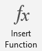
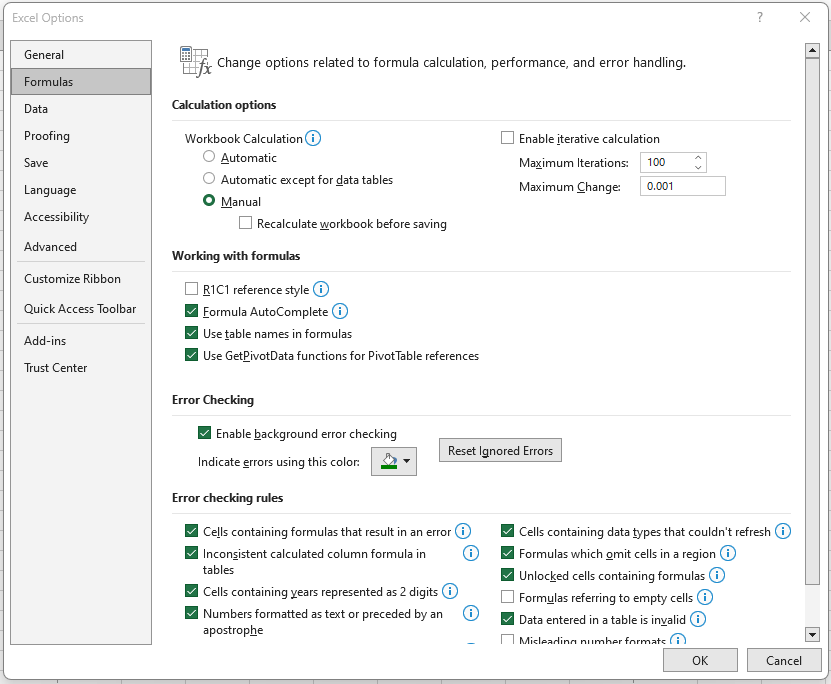
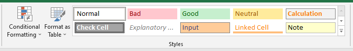

# Random Number Generators and Tables {#number-gen}

There may be cases when you need to generate random numbers in Excel. Excel has a few random number generators: `RANDBETWEEN`, `RAND`, and `RANDARRAY`. In this manual, you will get acquainted with the `RANDBETWEEN` function.

Tables are one of the most powerful Excel features. This lab shows you what you can do with a table. You will learn how to insert tables in Excel, table formatting and gain an understanding of Excel table functions and formulas.

## Random Samples

The one you will find most convenient for our labs is the function RANDBETWEENN(bottom,top), which Returns a random integer number between the numbers specified in the function's arguments. The other random functions are `RAND()`, which returns an evenly distributed random real number greater than or equal to 0 and less than 1, and `RANDARRAY(rows,columns,min,max,integer)`, which Returns an array of random numbers. For RANDARRAY, you can specify the number of rows and columns to fill, minimum and maximum values, and whether to return whole numbers or decimal values.

We focus now on the `RANDBETWEEN` function.


### Insert the function RANDBETWEEN on a PC

To use `RANDBETWEEN`, select a cell in the active worksheet. Click in the formula tab and then click the `Insert Function` ribbon. 

```{r function-button, echo=FALSE, fig.align = 'center', out.width='10%', fig.show='hold', fig.cap='Insert Function ribbon.', fig.alt = 'The Insert Function ribbon is depicted.'}

```

Select the category `All` in the dialog window. Then select `RANDBETWEEN` and then fill in the bottom and top numbers. Returns a random integer number between the numbers you specify. 

```{r irandbetween-pc, echo=FALSE, fig.align = 'center', out.width='60%', fig.show='hold', fig.cap='The dialog window of Insert Function on PC.', fig.alt = 'The dialog box of the Insert Function in Excel on a PC.'}

```


### Insert the function RANDBETWEEN on a MAC

1. Click on the `Formula` tab.
2. Click the `Insert Function` ribbon. 
3. You will see on the right side of the Excel window that the `Formula Builder` appears.
4. In the search box, start to type a keyword for the function you are looking for. Excel will list functions that match the criteria of the search you type.
5. Then select the function you wish to insert in the worksheet. In this case, the `RANDBETWEEN` function.
6. Adjust the arguments of the formula (top and bottom numbers) as needed.

```{r insert-function-dialog-mac, echo=FALSE, fig.align = 'center', out.width='90%', fig.show='hold', fig.cap='Dialog window of Insert Function on MAC.', fig.alt = 'The dialog box of the Insert Function in Excel on a MAC.'}

```

**Note:**	Alternatively, you can simply type `=RANDBETWEEN(bottom,top)` in the formula bar, with numbers in place of *bottom* and *top* for the arguments of the formula.

## Setting the Workbook to Manual Calculation

The random number generators of Excel have the characteristic that whenever a command is entered anywhere in the active workbook, the random numbers change because they are recalculated. To prevent this from happening, change the recalculate mode from automatic to manual. 

### Manual Calculation on a PC

1. Select `File` then `Options`.
2. Click on the tab labeled `Formulas`. 
3. Select `Manual Calculation` for `Workbook Calculation` and uncheck the option `Recalculate workbook before saving`. 
4. Then press `OK`.

```{r manualcalc-pc, echo=FALSE, fig.align = 'center', out.width='80%', fig.show='hold', fig.cap='Calculation options under Formulas in a PC.', fig.alt = 'A screenshot of the calculation options under Formulas in a PC.'}

```

### Manual Calculation on a MAC

1.	Go to `Excel Menu` then select `Preferences`

```{r manual-calculation1, echo=FALSE, fig.align = 'center', out.width='90%', fig.show='hold', fig.cap='Preferences in the Excel Menu on a MAC.', fig.alt = 'A screenshot Sub-menu Preferences in the Excel Menu on a MAC.'}

```

2.	Under `Formulas and Lists`, click on `Calculation`


```{r manual-calculation2, echo=FALSE, fig.align = 'center', out.width='60%', fig.show='hold', fig.cap='Formulas and Lists in Preferences on a MAC.', fig.alt = 'A screenshot of Formulas and Lists in Excel Preferences on a MAC.'}

```

3.	For `Workbook Calculation`, select `Manual calculation` and uncheck the option `Recalculate workbook before saving`.

```{r manual-calculation3, echo=FALSE, fig.align = 'center', out.width='60%', fig.show='hold', fig.cap='Calculation Options on a MAC.', fig.alt = 'A screenshot of Calculation Options on a MAC.'}

```

## Using the Recalculation Mode

Even if the `Calculation` option is set for `Manual`, you can use a ribbon command or keyboard shortcut to force a recalculation when needed.

You can still recalculate by pressing the keys `Shift` + `F9` on the keyboard on a PC  (For MAC, use keys `Command` + `=` ) or pressing the button `Calculate Now` in the `Formulas` Menu.


```{r calculation-ribbons, echo=FALSE, fig.align = 'center', out.width='30%', fig.show='hold', fig.cap='Calculation ribbon.', fig.alt = 'A screenshot of Calculation ribbon.'}

```
### Practice 1

Suppose that there are 95 students enrolled in a section of the course Introductory Statistics. Draw a random sample of fifteen (15) of the students. 

To draw the sample, assign each of the students a distinct number between 1 and 95. To find the numbers of the 15 students to be included in the sample, do the following steps.

1.	Change the calculation mode to `Manual` (as described above).
2.	Type the label *Sample* in Cell A1 ,
3.	Select Cell A2.
4.	Type `=RANDBETWEEN(1,95)` in the formula bar and press Enter. 
5.	Position the mouse pointer in the lower right corner of Cell A2 until it becomes a **`+`** sign, and click-drag downward until you reach Cell A16. Release. Then press the key `F9` (or `Calculate Now` button). 
6.	6)	Use one of the `Sort` buttons to sort the data to easily check for repetitions. If there are repetitions, press `Shift` + `F9` (or `Calculate Now`) again and re-sort. Below, with the data sorted, we can verify that there are no repetitions


## Creating Tables

To make working with data easier, you can organize data in a table format on a worksheet.

You are going to use Excel’s random number generator and tables to create a fictional grade book. 

### Practice 2

1. Select the block of cells D1:H11.
2. On the `Home` tab, in the `Styles` ribbon, click `Format as Table`, and then click the table style of your choice.

```{r table-style-group, echo=FALSE, fig.align = 'center', out.width='90%', fig.show='hold', fig.cap='Style ribbon.', fig.alt = 'A screenshot of the Style ribbon.'}

```

3. Select the `My table has headers` check box in the `Format as Table` dialog window.

```{r format-as-table, echo=FALSE, fig.align = 'center', out.width='70%', fig.show='hold', fig.cap='32: Format As Table window.', fig.alt = 'A screenshot  showing the window for the command Format As Table command.'}

```

**Note:** When you select a table by clicking the mouse pointer, the `Table Tools` menu becomes available, and a `Design` tab is displayed. To get a good idea of what you can add to or change in your table, click the `Design` tab, then explore the groups and options provided on this tab.

4. Replace the table headers. Instead of `Columns1` through `Column5`, replace headers by typing in them the following: *Name*, *Exam 1*, *Exam 2*, *Exam 3* and *Final Exam*.
5. Under header *Name*, in cells 2-11, create 10 students’ names, writing last name, and first name.
6. Now select the block of cells D2:D11. Click `Home > Sort & Filter > Select A to Z`. The fictional names should then appear in alphabetical order.
7. Select cell E2. Click on the `Formula` bar, type in `=RANDBETWEEN(0,100)`.
8. Position the mouse pointer in the lower right corner of cell E2 until it becomes a **`+`** sign and click-drag downward until you reach cell E11. Release (*Note:* Sometimes this feature is not needed within a formatted table).
9. Repeat the process above for Column F using `=RANDBETWEEN(40,98)`.
10. Repeat the process above for Column G using `=RANDBETWEEN(64,105)`.
11. Repeat the process above for Column H using `=RANDBETWEEN(37,100)`.
12. If the list of numbers is not randomized, click the button `Calculate Now`.

