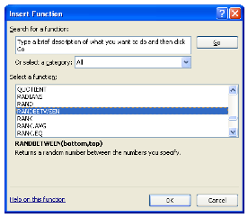
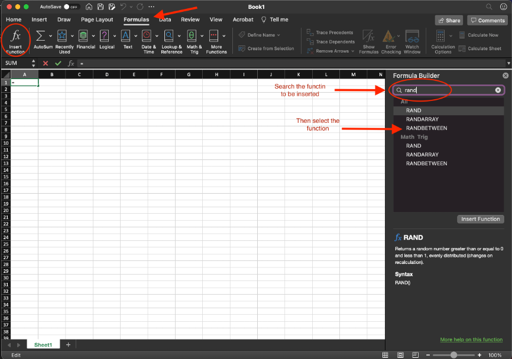
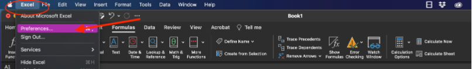
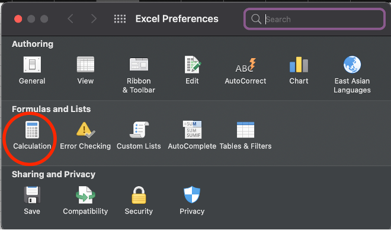
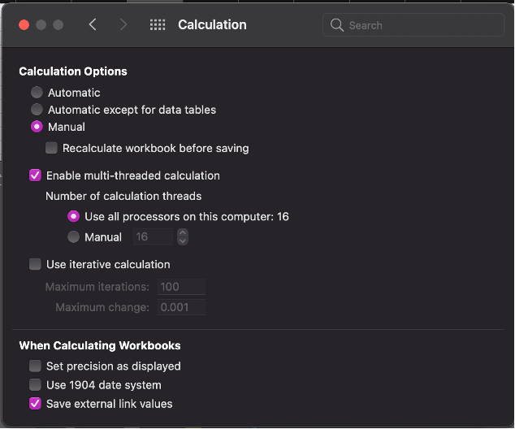
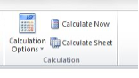
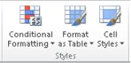

# Random Number Generator and Tables


## Random Samples

Excel has several random number generators. The one we will find most convenient is the function `RANDBETWEEN(bottom,top)`.

**	Insert the function RANDBETWEEN on a PC

To use `RANDBETWEEN`, select a cell in the active worksheet. Click in the formula bar and then click the `Insert Function` button. 

```{r function-button, echo=FALSE, fig.align = 'center', out.width='10%', fig.show='hold', fig.cap='Insert Function Button', fig.alt = 'Insert Function Button depicted.'}

```

Select the category `ALL` in the dialog window.
Then select `RANDBETWEEN` and then fill in the bottom and top numbers. 

insert_function_dialog_pc

```{r insert-function-dialog-pc, echo=FALSE, fig.align = 'center', out.width='60%', fig.show='hold', fig.cap='Dialog Box of Insert Function on PC.', fig.alt = 'Dialog box of the Insert Function in Excel on a PC.'}

```


### Insert the function RANDBETWEEN on a MAC

1.	Click on the tab `Formula`
2.	Click the `Insert Function` ribbon
3.	You will see on the right side of the Excel window that the `Formula Builder` appears
4.	In search box, start to type a key word for the function you are looking for 
5.	Then select the function you wish to insert in the worksheet
6.	Adjust the parameters of the formula as needed

```{r insert-function-dialog-mac, echo=FALSE, fig.align = 'center', out.width='70%', fig.show='hold', fig.cap='Dialog Box of Insert Function on MAC.', fig.alt = 'Dialog box of the Insert Function in Excel on a MAC.'}

```

*Remark:*	Alternatively, you may simply type `=RANDBETWEEN(bottom,top)` in the formula bar, with numbers in place of “bottom” and “top” for the arguments of the formula.

## Setting the Workbook to Manual Calculation

The random number generators of Excel have the characteristic that whenever a command is entered anywhere in the active workbook, the random numbers change because they are recalculated. To prevent this from happening, change the recalculate mode from automatic to manual. 

### Manual Calculation on a PC

1.	Select File then `Options`
2.	 Click on the tab labeled `Formulas` 
3.	For `Workbook Calculation`, select `Manual Calculation` and uncheck the option `Recalculate Workbook Before Saving`
4.	Then press `OK`

### Manual Calculation on a MAC

1.	Go to `Excel Menu` then select `Preferences`

```{r manual-calculation1, echo=FALSE, fig.align = 'center', out.width='70%', fig.show='hold', fig.cap='Preferences in the Excel Menu on a MAC.', fig.alt = 'Screenshot Sub-menu Preferences in the Excel Menu on a MAC.'}

```

2.	Under `Formulas and Lists`, click on `Calculation`


```{r manual-calculation2, echo=FALSE, fig.align = 'center', out.width='70%', fig.show='hold', fig.cap='Formulas and Lists in Preferences on a MAC.', fig.alt = 'Screenshot of Formulas and Lists in Excel Preferences on a MAC.'}

```

3.	For `Workbook Calculation`, select `Manual calculation` and uncheck the option `Recalculate workbook before saving`.

```{r manual-calculation3, echo=FALSE, fig.align = 'center', out.width='70%', fig.show='hold', fig.cap='Calculation Options on a MAC.', fig.alt = 'Screenshot of Calculation Options on a MAC.'}

```

## Using the Recalculation Mode

Even if the `Calculation` option is set for `Manual`, you can use a Ribbon command or keyboard shortcut to force a calculation when needed.
You can still recalculate by pressing the keys `Shift + F9` on keyboard key on a PC  (For MAC, use keys `Command + =` ) or pressing the button `Calculate Now` in the `Formulas` Menu.

calculation_ribbons

```{r calculation-ribbons, echo=FALSE, fig.align = 'center', out.width='30%', fig.show='hold', fig.cap='Calculation Buttons on a MAC.', fig.alt = 'Screenshot of Calculation buttons on a MAC.'}

```
**Practice 1:**

Suppose that there are 95 students enrolled in a section of introductory statistics. Draw a random sample of fifteen of the students. 

To draw the sample, assign each of the students a distinct number between 1 and 95. To find the numbers of the fifteen students to be included in the sample, do the following steps.

1.	Change the Calculation mode to Manual (as described above)
2.	Type the label “Sample” in Cell A1 
3.	Select Cell A2
4.	Type `=RANDBETWEEN(1,95)` in the formula bar and press Enter. 
5.	Position the mouse pointer in the lower right corner of Cell A2 until it becomes a `+` sign, and click-drag downward until you reach Cell A16. Release. Then press the key `F9` (or `Calculate Now`). 
6.	Use one of the `Sort` buttons to sort the data, so you can easily check for repetitions. If there are repetitions, press `Shift + F9` (or `Calculate Now`) again and re-sort. Below, with the data sorted, we can verify that there are no repetitions


## Creating tables

To make working with data easier, you can organize data in a table format on a worksheet.
You are going to use Excel’s random number generator and tables to create a fictional grade book. 

**Practice 2:**
1.	Select the block of cells D1:H11
2.	On the Home tab, in the Styles group, click `Format as Table`, and then click the table style of your choice
3.	Select the `My table` has headers check box in the `Format as Table` dialog box

```{r table-style-group, echo=FALSE, fig.align = 'center', out.width='30%', fig.show='hold', fig.cap='Table Style Group buttons.', fig.alt = 'Screenshot of Table Style Group.'}

```

*Remark:* When you select a table by clicking with the mouse pointer on it, the Table Tools menu become available and a Design tab is displayed. To get a good idea of what you can add to or change in your table, click the Design tab, and then explore the groups and options that are provided on this tab

4.	Replace the table headers. Instead of Columns1 through Column5, replace headers by typing in them the following: Name, Exam 1, Exam 2, Exam 3 and Final Exam
5.	Under header Name, in cells 2-11, create 10 students’ names, writing last name, first name
6.	Now select block of cells D2:D11. Click `Home > Sort & Filter > Select A to Z`. The fictional names should then appear in alphabetical order
7.	Select cell E2. Click on the formula bar, type in `=RANDBETWEEN(0,100)`
8.	Position the mouse pointer in the lower right corner of cell E2 until it becomes a + sign and click-drag downward until you reach cell E11. Release (*Note:* Sometimes this feature is not needed within a formatted table)
9.	Repeat the process above for Column F using `=RANDBETWEEN(40,98)`
10.	Repeat the process above for Column G using `=RANDBETWEEN(64,105)`
11.	Repeat the process above for Column H using `=RANDBETWEEN(37,100)`
12.	If the list of numbers is not randomized, click the button `Calculate Now`

