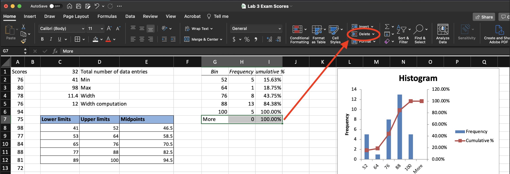
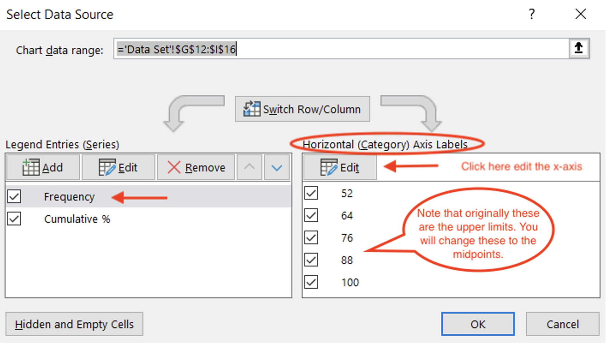

# Frequency Tables and Histograms

You will construct a histogram with 5 classes (bars) using Excel. 
Graphing a histogram manually requires determining minimum and maximum values in a data set, class width, the lower and upper limits of classes of values, class boundaries, midpoints, etc. This is similar in Excel. You will need the upper-class limits and the midpoints for adjusting the graph created with Excel.

Throughout this manual, *Select* means to left-click with the mouse/pad.

##	Preparation

In this lab, you will use a data set that contains scores received on an MA-336 Exam. Download the data set. called *Lab 3 Exam Scores.xlsx* from here:  [**https://github.com/bsosnovski/Intro-Stats-Excel-Lab-Manual/blob/main/Data_Sets/Lab-3-Exam-Scores.xlsx**](https://github.com/bsosnovski/Intro-Stats-Excel-Lab-Manual/blob/main/Data_Sets/Lab-3-Exam-Scores.xlsx)

Open the Excel file you downloaded and follow the instructions below.

##	Initial Computations
1. Select cell C1 and in the formula bar type in `=COUNT(A2:A33)`.

**Note:** You can fill in the input range, A2:A33, in the formula count above by manually typing the address of the cells containing the data values. Alternatively, you can select cells that form the Input Range by clicking on A2, holding, and dragging downward until you reach cell A33. Then release.

2. Type in cell D1 the label *Total number of data entries*.
3. Select cell C2 and in the formula bar type in `=MIN(A2:A33)`.
4. Type in cell D2 the label *Min*.
5. Select cell C3 and in the formula bar type in `=MAX(A2:A33)`.
6. Type in cell D3 the label *Max*.
7. Select cell C4 and in the formula bar type in `=(C3-C2)/5`.
8. Type in cell D4 the label *Width Computation*.
9. 9)	Round up the value resulting in cell C4 to the next whole number by using the formula `=ROUNDUP(C4,0)` in cell C5 the adjusted value for the width. 

**Note:** The formula above uses the cell address (C4) to identify the number to be rounded up with 0 decimal places.

10. Type in cell D5 the label *Width*.

```{r initial-comp, echo=FALSE, fig.align = 'center', out.width='60%', fig.show='hold', fig.cap='Initial computations for constructing a histogram.', fig.alt = 'A screenshot of the initial computations for constructiong a hstogram.'}

```

## Class Limit Calculations

1. Type in cell C7 the label *Lower Limits*.
2. In cell C8, type the formula `= C2`. This will copy the value in cell C2 as the histogram's lower limit for the first class.
3. 3)	Select cell C9, and in the formula bar, type `=SUM(C8,$C$5)`. Remember  the `dollar sign` because the value in C5, the width, is a fixed value for all formulas you use here.

**Note:** You may also do the computation in Step 3 above using the keyboard key `+`.

4. Position the mouse pointer in the lower right corner of cell C9 until it becomes a `+` sign and click, hold, and drag downward until you reach cell C12. Then release. 

**Note:** You should have a total of 5 class limits since your histogram has 5 classes.

**Note:** If the formulas do not update automatically, do Step 5 below. Otherwise, skip to Step 6.

5. Select `Formulas>Calculate Now`.
6. Type in cell D7 the label *Upper Limits*.

7.Type the values of the upper limits of each class in cells D8 through D12. 

**Note:** You can also be creative and use a formula to do the work in this step. There are different ways of entering the upper limits using formulas, but that is not being requested from you for this lab.

8. Type in cell E7 the label *Midpoints*.
9. Compute the values of the midpoints (lower limit + upper limit)/2 of each class in cells E8 through E12 by using Excel formulas.

**Note:** To do this step, use the techniques and Excel functions presented above (create the Excel formula!)

```{r class-limits-comp, echo=FALSE, fig.align = 'center', out.width='50%', fig.show='hold', fig.cap='Class limits computations.', fig.alt = 'A screenshot of the class limits computations.'}

```

## Creating the Histogram

1. Select `Data>Data Analysis>Histogram` and click `OK`.

**Note:** If `Data Analysis` does not appear in the Data menu, refer to the instructions in *Lab* ***\@ref(start)*** *Getting Started with Excel* how to make it available. 

2. In the dialog window, first click in the `Input Range` field then type in `$A$2:$A$33`. 

**Note:** Instead of typing, you can *select cells* that form the Input Range by clicking on A2, holding, and dragging downward until you reach cell A33. Then release.

3. 3)	Click the `Bin Range` field in the dialog window first, then type in  `$D$8:$D$12`. 

**Note:** You can also select cells containing the upper limits instead of typing‼!

4. You have the option to have the graph placed in a specific cell or range of cells (for this option check `Output Range` as in the picture above, you may select a different cell address) or in a new worksheet (for this check option `New Worksheet Ply`).
5. In the pop-up window, Check the boxes for `Cumulative Percentage` and `Chart Output`. 
6. Then click `OK`.

```{r histogram-mac, echo=FALSE, fig.align = 'center', out.width='60%', fig.show='hold', fig.cap='Dialog window with the histogram options.', fig.alt = 'A screenshot showing the dialog window with histogram options.'}

```

After the steps above, Excel presents a frequency table and the corresponding graph. Excel counts the frequency of each class based on the *Bins* values you entered in the dialog window for the histogram. Thus, it counts how many values are in the date set (Input Range) up to the upper limits.

The graph is a *raw histogram* that needs to be adjusted to resemble an actual histogram.

```{r raw-histogram, echo=FALSE, fig.align = 'center', out.width='80%', fig.show='hold', fig.cap='Resulting histogram.', fig.alt = 'A screenshot showing the resulting histogram graph.'}

```
## Removing the *More* bar of the Histogram

1. If you chose `New Worksheet Ply` in Step 4 above, select the Worksheet that contains the graph. Otherwise, go to next Step 2 below.
2. You may resize the graph by clicking anywhere within the figure. Handles appear along the perimeter of the graph. You can change the shape of the figure by clicking on a handle and dragging it. Make your graph to be displayed in an appropriate size.
3. A frequency table was created with the graph in the process. That table controls some aspects of the graph. Select the cells in the last row of the frequency table, the one that contains the word *More*.
4. Select `>Home>Delete` (you can also do this by `RIGHT-clicking` on the selected cells and then the option `Delete`).

**Note:** If you do not delete the row in the table, the graph will contain an extra bar on the right of the graph with a frequency equal to zero. **Be sure to delete the cells and not just delete the contents in those cells.**

5. If the graph doesn’t update automatically, select `Formulas>Calculate Now`.

```{r delete-more-row, echo=FALSE, fig.align = 'center', out.width='100%', fig.show='hold', fig.cap='Deleting the *More* row from the frequency table of the histogram.', fig.alt = 'A screenshot showing how to delete the row labeled More.'}

```

After Steps 4-5, the last column in the graph, labeled *More* will no longer be displayed in the graph.

6. `RIGHT-click` on any one of the vertical bars of the graph and then select `Format Data Point` (or `Format Data Series`). Alternatively, you can also double-click with your mouse on a vertical for that.
7. Move `Gap Width` to position `0%` (this makes the bars of the graph touch).


## Adjusting the Horizontal Axis

### MAC

1. `RIGHT-click` on any vertical bar of the graph. From the menu, click the option `Select Data`. 
2. Click `Edit` under *Horizontal (Category) Axis Labels*. Click and drag over the range `E8:E12` (midpoints). 
3. Click `OK`. This is to re-label the x-axis with the midpoints replacing the upper limits.
4. Click OK again.

```{r adjusting-horizontal-axis-mac, echo=FALSE, fig.align = 'center', out.width='100%', fig.show='hold', fig.cap='Adjusting the horizontal axis on a MAC.', fig.alt = 'A screenshot of the dialog window on a MAC to adjust the horizontal axis of the graph.'}

```

###	PC
1. `RIGHT-click` on any vertical bar of the graph. From the menu, click the option `Select Data`. 
2. Click `Edit` under *Horizontal (Category) Axis Labels*. 

```{r adjusting-horizontal-axis-pc, echo=FALSE, fig.align = 'center', out.width='90%', fig.show='hold', fig.cap='Adjusting the horizontal axis on a MAC.', fig.alt = 'A screenshot of the dialog window on a PC to adjust the horizontal axis of the graph.'}

```

3. Click in the filed *Axis label range*, delete whatever values are in there, and drag over the range `E8:E12` to select midpoints cells. 
4. Click `OK`.  This is to re-label the x-axis with the midpoints instead of the upper limits.
5. Click `OK` again.

```{r relabel-horiontal-axis-pc, echo=FALSE, fig.align = 'center', out.width='70%', fig.show='hold', fig.cap='Relabeling the horizontal axis on a PC.', fig.alt = 'A screenshot of the dialog window to relabel the horizontal axis on a PC.'}

```

##	Adjusting the Title of the Histogram

1. To change the histogram title, click on the word *Histogram*, which appears
in a window. Change the title to *MA336 Exam Scores*.
2. Click on the word *Bin* and change the x-axis label to *Scores*.

After all the adjustments are made, the graph will look like the one below.


```{r adjusted-histogram, echo=FALSE, fig.align = 'center', out.width='70%', fig.show='hold', fig.cap='Adjusted histogram.', fig.alt = 'The adjusted histogram.'}

```

## Practice

Practice:
Dan gathered data about the number of minutes per day that a sample of teenagers spends in doing a physical activity. 

15, 30, 45, 25, 30, 15, 20, 10, 30, 40, 25, 15, 20, 25, 25, 29, 40, 10, 20, 27, 10, 15, 20, 20, 30, 25, 20, 60, 60, 75, 50, 45 

Use the data and the techniques learned in these lab instructions to build a histogram with five classes and descriptive statistics.

