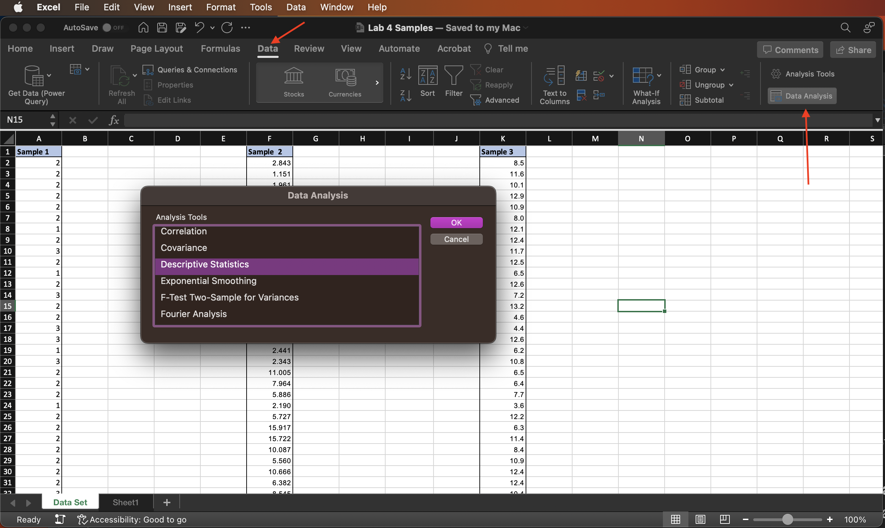

# Measures of Central Tendency and Variation

In this lab, you will use Excel to determine a data set's mean, median, mode, and standard deviation. A measure of central tendency shows where the center or middle of the data set is located. A measure of variation shows the spread among data values.

Throughout these instructions, *Select* means to left-click with the mouse/pad.

## Preparation
In this lab, you will use a data set that contains three samples. You will compute descriptive statistics in different ways. Download the data set called *Lab 4 Samples.xlsx* from here:  [**https://github.com/bsosnovski/Intro-Stats-Excel-Lab-Manual/blob/main/Data_Sets/Lab-4-Samples.xlsx**](https://github.com/bsosnovski/Intro-Stats-Excel-Lab-Manual/blob/main/Data_Sets/Lab-4-Samples.xlsx)

* Sample 1 contains 100 data values.
* Sample 2 contains 120 data values.
* Sample 3 contains 95 data values.

## Excel Instructions

Open the Excel file you downloaded and follow the instructions below.

### Using the Descriptive Statistics in Excel to Obtain the Measures {#descriptive-stats}

***Sample 1***

1. Go to `Data > Data Analysis`.
2. Select `Descriptive Statistics` and click `OK`. 

**Note:** If `Data Analysis` does not appear in the Data menu, refer to the instructions in Lab **\@ref(start)** *Getting Started with Excel* how to make it available. 

```{r descriptive-stats1, echo=FALSE, fig.align = 'center', out.width='80%', fig.show='hold', fig.cap='Data Analysis dialog window.', fig.alt = 'A screenshot of the Data Analysis dialog window.'}

```

3. The *Descriptive Statistics* window should appear. Complete the Descriptive Statistics window with the information needed from the data in Sample 1.
4. The `Input Range` for Sample 1 has cell address `$A$2:$A$101` (not including the label). If you include the label cell in the address, the address is `$A$1:$A$101` (the first cell address is different). You may want to fill in the input range by manually typing the address or by selecting the cells. 
5. If the data values are stacked in a column, then check the options `Grouped by Columns`. If they were entered into *Rows* instead, then you would select the rows option.
6. After you filled in the input range field, check or uncheck the box `Labels in the first row` according to what is in the input range.
7. Check the option `Output Range` and select a cell in a blank area of your worksheet.
8.Check the option `Summary statistics`. 

```{r descriptive-stats2, echo=FALSE, fig.align = 'center', out.width='80%', fig.show='hold', fig.cap='Descriptive Statistics dialog window.', fig.alt = 'A screenshot of the Descriptive Statistics dialog window.'}
knitr::include_graphics('descriptive-stats2.png')
```

These options give you the statistics of Sample 1 such as mean, median, standard deviation, and others.

```{r summary-stats, echo=FALSE, fig.align = 'center', out.width='40%', fig.show='hold', fig.cap='The resulting summary statistics for Sample 1.', fig.alt = 'A screenshot of the The resulting summary statistics for Sample 1.'}
knitr::include_graphics('summary-stats.png')
```

**Practice 1:**

Now you will do the same work above (Steps 1-8) for *Samples 2* and *3*. 

**Note:** In the instructions above, you must adjust the cell addresses for Samples 2 and 3.

### Using Excel’s Functions to Obtain the Measures {#excel-functions}

***Sample 1***

1. Next to the column containing Sample 1 (between Sample 1 and Sample 2), click on an empty cell of the worksheet and type *Mean*.
2. Click on the cell right next to it and type `=AVERAGE(A2:A101)`.

**Note:** You can also use the Excel function Average by clicking: `Formulas > Insert Function`.

3. Below the cell *Mean*, type the word *Median*.
4. Click on the cell right next to it and type `=MEDIAN(A2:A101)`.
5. Below the cell *Median*, type *Stand. Dev.*
6. Click on the cell right next to it and type `=STDEV.S(A2:A101)` (sample standard deviation).
7. Excel does not have a *Range* function, so below the standard deviation type the word *Range* and next to it compute the range by using the formula `Range = Max – Min`.
8. Below the cell *Range*, type *Mode(s)*.

You will investigate the many modes in the data set and what they are. For that, you will use the function `MODE.MULT()`. This function returns a vertical array of the most frequently occurring, that is, the mode(s) of the data set. 

9. Starting with the cell next to the word *Mode(s)*, select a vertical range of cells (a block of any number of vertical cells).
10. While the block of cells is selected, type the function `MODE.MULT(A2:A101)` into the Formula bar.
11. Press the keys `Control` + `Shift` + `Enter` (For MAC, use the keys `Command` + `Shift` + `Enter`).

**Note:** Be careful! If you only press Enter or use the function MODE, Excel will only display one value for the mode even if there are multiple modes. 

**Note:** Here is a link to a video tutorial about how to use the function MODE.MULT: [**https://youtu.be/BPboB7Ov-A8**](https://youtu.be/BPboB7Ov-A8).

**Note:** If there is no mode, #N/A will appear as a result. If there is only one mode, MODE.MULT returns the same value repeatedly.

```{r excel-functions, echo=FALSE, fig.align = 'center', out.width='40%', fig.show='hold', fig.cap='The results from the Excel functions used above..', fig.alt = 'A screenshot of the results from the Excel functions used.'}

```

**Practice 2:**

Now you will do the same work above (Steps 1-10) for *Samples 2* and *3*. 

**Note:** In the instructions above, you must adjust the cell addresses for Samples 2 and 3.

Compare the results obtained in Section **\@ref(descriptive-stats)** with the results obtained in Section **\@ref(excel-functions)**. The results should be the same.


