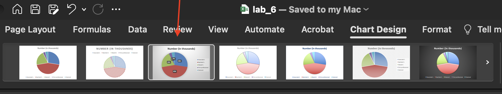
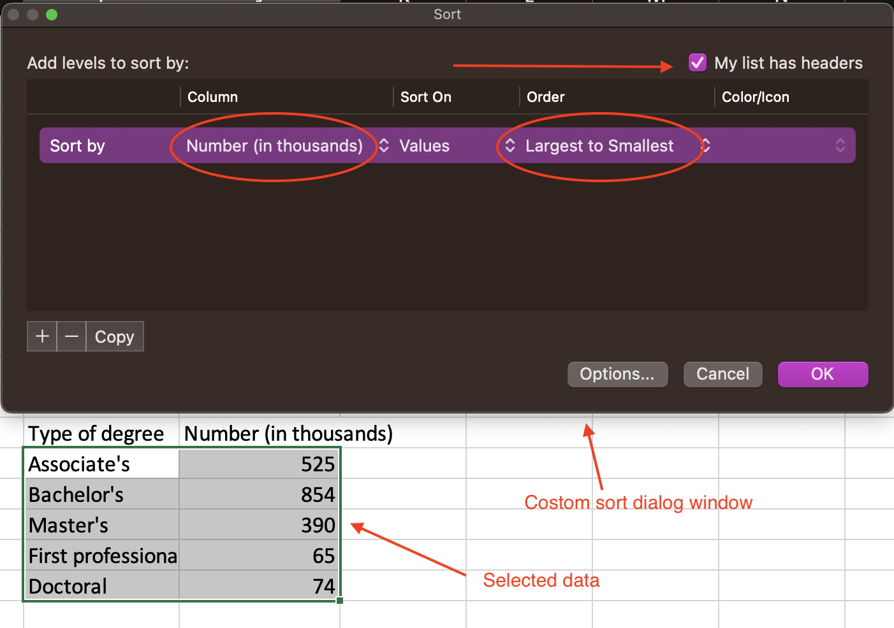

# Pie and Pareto Charts

In this lab, you will generate pie and Pareto charts using Excel.

A *pie chart* is a tool to display basic statistical information for qualitative data, and is one of the easier charts to make in Excel.

A *Pareto chart* is a bar graph that visually depicts which situations are more significant.

## Preparation

In this lab, you will use a data set that provides a snapshot of a sample Netflix user base. The data set includes information such as the user's subscription type, device type, and the country in which they are located.

Download the data set called *Lab 6 Netflix Sample.xlsx* from here: [**https://github.com/bsosnovski/Intro-Stats-Excel-Lab-Manual/blob/main/Data_Sets/Lab-6-Netflix-Sample.xlsx**](https://github.com/bsosnovski/Intro-Stats-Excel-Lab-Manual/blob/main/Data_Sets/Lab-6-Netflix-Sample.xlsx).

##	Pie Charts

A *pie chart* (or a circle chart) is a circular statistical graphic that is divided into slices (or wedges) to illustrate numerical proportions.

1. Open a new Excel worksheet and enter *Earned Degree* data, as shown below.


```{r degree-earned-data, echo=FALSE, fig.align = 'center', out.width='50%', fig.show='hold', fig.cap='Earned degree data.', fig.alt = 'Earned Degree data.'}

```

2. Select the cells A1:B6. 
3. Go to the `Insert` tab. Select the `leftmost 2D Pie diagram` in the top row in the `Charts` ribbon.

```{r pie-chart, echo=FALSE, fig.align = 'center', out.width='40%', fig.show='hold', fig.cap='Pie chart options in the Insert tab.', fig.alt = 'A screenshot of the pie chart options.'}

```

4. If your graph does noy appear with a title and legend, do Steps 5 and 6 below.
5. When you select the graph, the tab `Chart Design` appears in the menu bar (you must select the graph for this tool to appear).
6. Choose Style 3 for your pie chart.

```{r pie-chart-design, echo=FALSE, fig.align = 'center', out.width='100%', fig.show='hold', fig.cap='Options in the Chart Design tab for pie charts.', fig.alt = 'A screenshot of the options in the Chart Design tab for pie charts.'}

```

**Note:** Style 3 includes titles, legends, and labels in percent form. Check other styles to see the differences among them.

7. Replace *Number (in thousands)* with the title *Earned Degrees Conferred in 2000*.

**Note:** You can `RIGHT-click` on one of the data labels (e.g., on the percent of 45%) and then select `Format Data Labels` to change the format of the labels in your graph.

### Practice 1

Use Excel to build a pie chart for the data containing *Device Type* in the *Lab 6 Netflix Sample.xlsx* file.

## Pareto Charts

A *Pareto chart* is a bar graph with the bars arranged from the tallest bar to the shortest bar. Because of that, we need first to put the data in descending order.

### Sorting Data

1. Highlight the cells A1:B6 again. 
2. `Copy` (`CTRL` + `C`) the data, click on cell E1 (or any empty cells of the worksheet), and `Paste` (`CTRL` + `V`) the data. 
3. Highlight the cells E1:F6 (or the cells that contain the copy of the data). Select `Custom Sort` in the *Sort & Filter* ribbon in the `Home` tab in the menu bar.
4. In the Sort dialog window that appears. Select the following options:
     * *Sort by* -> `Number (in thousands)`
     * *Sort on* -> `Values`
     * *Order* -> `Largest to Smallest`
     
This will sort both highlighted columns concerning the highest frequencies.

5. Check the box to the left on `My list has headers`. Click `OK`.

```{r sorting-earn-degree-data, echo=FALSE, fig.align = 'center', out.width='70%', fig.show='hold', fig.cap='Custom sort options..', fig.alt = 'A screenshot of the custom sort options.'}

```


### Building the Pareto Chart

1. Select the cells E1:F6 (or the cells containing the copy of the data) that have been sorted. 
2. Go to `Insert > Column chart` and choose the leftmost top type.
3. Change the title of the graph to *Earned Degrees conferred in 2000*.
4. With the graph selected, go to the `Chart Design` tab. 
5. To add axis titles, click `Add Chart Element > Axis Titles > Primary Horizontal` and then `Add Chart Element > Axis Titles > Primary Vertical`.
6. Replace the horizontal axis title with the *Type of Degree*.
7. Replace the vertical axis title with *In Thousands*.

### Practice 2

Use Excel to build a Pareto chart for the data containing *Country* in the *Lab 6 Netflix Sample.xlsx* file.


