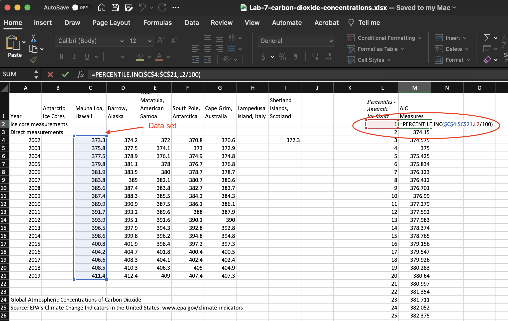

# Measures of Location

*Measures of location* are numbers that indicate the position of data values in a data set. In this lab, you will use Excel to determine measures of location in a distribution: percentiles and standard scores (*z*-scores).

A *percentile* represents the location of a value as a cumulative percentage. The *k*-th (where 1 ≤ *k* ≤ 99) percentile is the data value that indicates the *k*% percentage of all values in the data set that falls at or below it, and (100-*k*)% of all data falls above it.

Another common measure of location is the standard value score, which relates to the distribution’s spread. A *standard score* (or *z-score*) indicates the position of a value in terms of its distance to the mean in units of standard deviation.

## Preparation

You will use a data set that provides measures of global atmospheric concentrations of carbon dioxide from 2002 to 2019. 

Download the data set called Lab 7 Carbon Dioxide Concentrations.xlsx from here [**https://github.com/bsosnovski/Intro-Stats-Excel-Lab-Manual/blob/main/Data_Sets/Lab-7-carbon-dioxide-concentrations.xlsx**](https://github.com/bsosnovski/Intro-Stats-Excel-Lab-Manual/blob/main/Data_Sets/Lab-7-carbon-dioxide-concentrations.xlsx).  

Open the Excel file *Lab 7 Carbon Dioxide Concentrations.xlsx* and follow the instructions below.

## Percentiles

The function `PERCENTILE.INC(array,k)` returns the *k*-th percentile of values in a data set, where *k* is in the range 0..1, inclusive, representing the decimal form of the percentage. The function `PERCENTILE.EXC(array,k)` works similarly, but *k* is exclusive in the range 0..1.

*Example:* Suppose a data set contains the test scores for a class of 20 students, and you want to calculate the 80th percentile score. Assuming the test scores are in cells A1:A20, you would use the formula `=PERCENTILE.INC(A1:A20, 0.80)`. This formula will return the value at the 80th percentile in the data set, representing the score separating the top 20% of students from the rest.

The following are instructions for you to find all percentiles of the carbon dioxide measured in *Mauna Loa, Hawaii*, contained in the file you downloaded.

1. Go to the top of an empty column and type *Percentiles- Mauna Loa, Hawaii* as the column's header.
2. Below *Percentiles- Mauna Loa, Hawaii*, create a list of numbers from 1 to 99 (use the instructions in *Section* ***\@ref(seq-numbers)*** from *Lab* ***\@ref(time-series)*** *Time Series and Measures of Central Tendency*).

3. In the column next to it, type the header *Hawaii Measure*.
4. Below *Hawaii Measure*, enter the formula `=PERCENTILE.INC($C$4:$C$21,L2/100)`.
5. Select the cell containing the formula in Step 4.
6. Position the mouse pointer in the lower right corner of the selected cell until it becomes a `+` sign and click-drag downward across the range that covers all the values of the *Hawaii measure*.

**Note:** In the formula above, the address of the cells containing the data set has dollar signs (`$`) before the row and the column number to keep the calculations from changing the location of the data set. 

```{r percentiles, echo=FALSE, fig.align = 'center', out.width='100%', fig.show='hold', fig.cap='Percentiles calculations for Hawaii measures.', fig.alt = 'A screenshot of a spreadsheet with the percentiles calculations for Hawaii measures.'}

```

**Note:** `PERCENTRANK.INC` uses interpolation to find percentiles for values that are not originally in the data set.

## Percentile Ranks

The function `PERCENTRANK.INC(array, x, [significance])` calculates a specific value's relative position within a data set, expressed as a percentile rank between 0 and 1, inclusive. *Significance* is an optional argument. that identifies the number of significant digits for the returned percentage value. If omitted, `PERCENTRANK.INC` uses three digits (0.xxx).

*Example:* Suppose that a data set contains the test scores for a class of 20 students, and you want to find the percentile rank of the value in cell A1. You would use the following formula `=PERCENTRANK.INC(A1)`. This formula will return the corresponding percentile of the value with three (3) decimal places.

1. Go to the top of another empty column and type *Hawaii Measure* as the header of the column.
2. Copy the values in cells C4:C21 and paste them below the header *Hawaii Measure*.
4. Below *Percentile Rank*, enter the formula `=PERCENTRANK.INC ($O$2:$O$19,O2)`.
5. Select the cell containing the formula above.
6. Position the mouse pointer in the lower right corner of the selected cell until it becomes a `+` sign and click-drag downward across the range that covers all the values in Step 3. The results are in the decimal form.

```{r percentranks, echo=FALSE, fig.align = 'center', out.width='35%', fig.show='hold', fig.cap='Percentile rank calculations for the Hawaii measures.', fig.alt = 'A screenshot of the percentile rank calculations for the Hawaii measures.'}

```


**Note:** To convert the results to percentages, select the values in the column *Percentile Rank*, go to the `Home` tab, and then change the format to `Percentages` in the `Number` ribbon.

```{r number-ribon-percentages, echo=FALSE, fig.align = 'center', out.width='35%', fig.show='hold', fig.cap='Numbers ribbon in the Home tab displaying the Percentage format.', fig.alt = 'A screenshot of the Numbers ribbon displaying the Percentage format.'}

```
 
### Practice 1

Use Excel to calculate the percentiles and percentile ranks of the values in the column *South Pole, Antarctica*, in *Lab 7 Carbon Dioxide Concentrations.xlsx*.

## Standard Scores

The *standard score* (*z*) indicates the location of a value in the distribution as a function of how far the value is from the mean of the distribution in terms of the standard deviation.

### Calculating the Mean and Standard Deviation {#mean-st-dev}

In this part of the lab, you will compute the mean and the standard deviation of the distribution of *Hawaii Measures*.

1. In an empty cell, type *Mean* and next to the cell, compute the mean using the function `=AVERAGE(C4:C21)`. 
2. In another empty cell type *Stand Dev* and next to the cell, compute the standard deviation using the function `=STDEV.S(C4:C21)`.
3. In the `Number` ribbon, adjust the standard deviation value to have two (2) decimal places.

The result for the mean is 391.51, and the standard deviation is 11.78.

### Converting to Z-Scores 

The function `STANDARDIZE(x, mean, stand_dev)` returns a normalized value *x* from a distribution characterized by mean and standard deviation. The normalized value is the same as the *z*-score of the value. 

1. Go to the top of an empty column and type *Z-Scores* as the column's header.
2. Below *Z-Scores*, use the function `= STANDARDIZE(C4, mean, stand_dev)` to convert the value in cell C4 in the data set. In the formula, replace mean with the cell address containing the mean value from calculations in *Section* ***\@ref(mean-st-dev)***, and replace `stand_dev` with the cell address with the standard deviation calculated. Include `$` in the mean and standard deviation addresses since they are fixed for all data values.
3. Adjust the *z*-score to have two (2) decimal places.
4. Select the cell containing the formula in Step 2.
5. Position the mouse pointer in the lower right corner of the selected cell until it becomes a `+` sign and click-drag downward across the range that covers all the *Hawaii measures*.

As a result, the *z*-scores range from -1.55 to 1.69.

### Practice 2

Use Excel to calculate the *z*-scores of the values in the column *South Pole, Antarctica* in *Lab 7 Carbon Dioxide Concentrations.xlsx*. 


 
