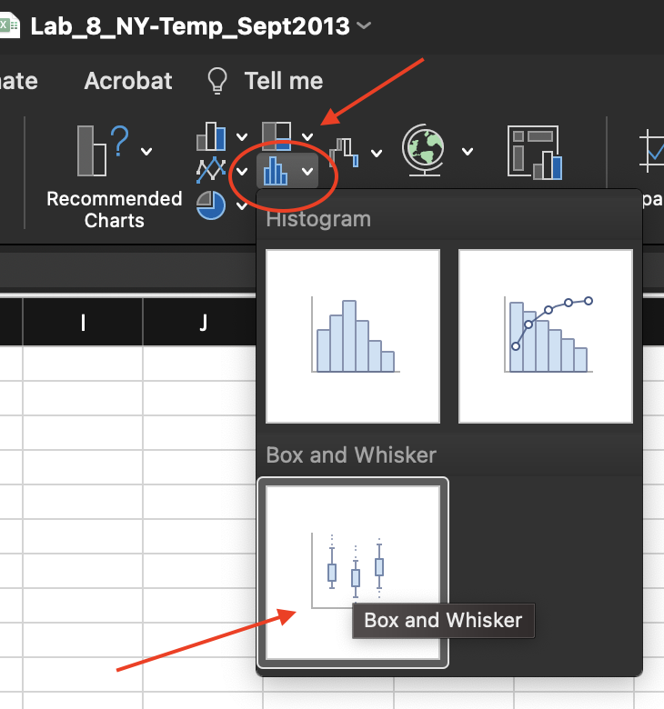
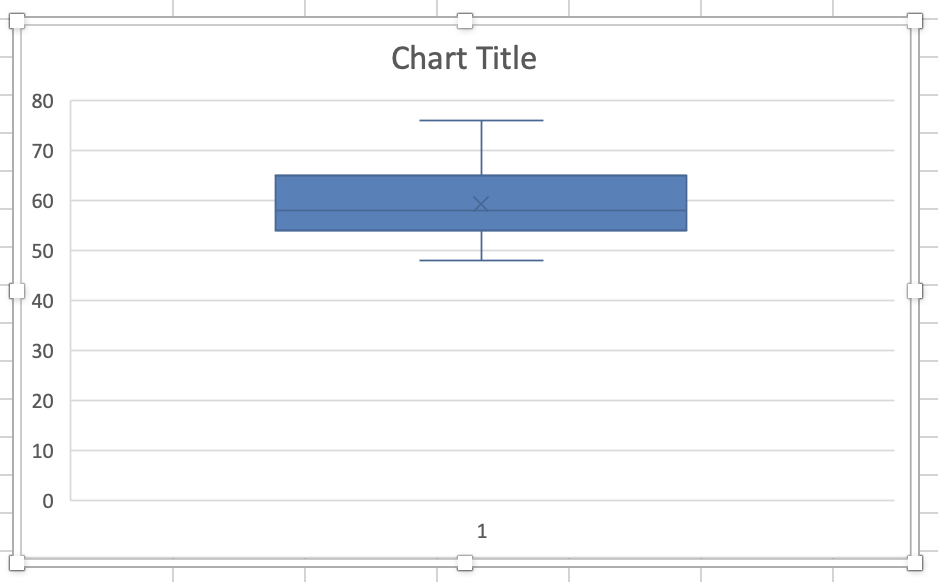
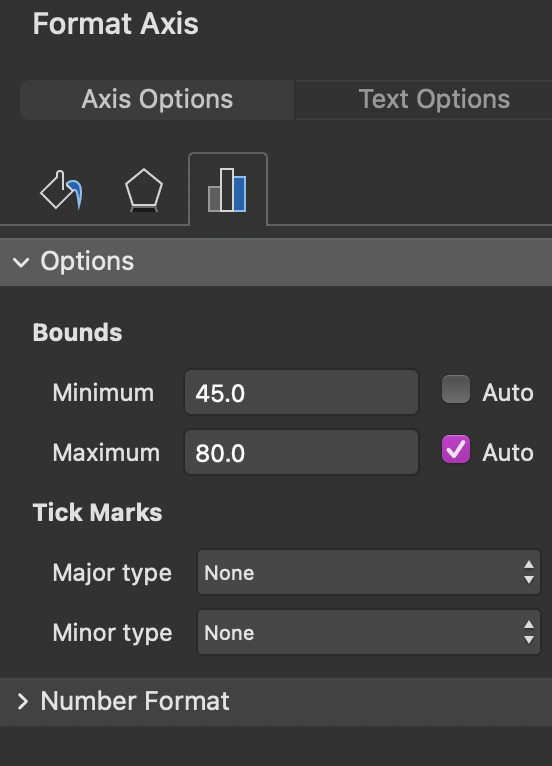
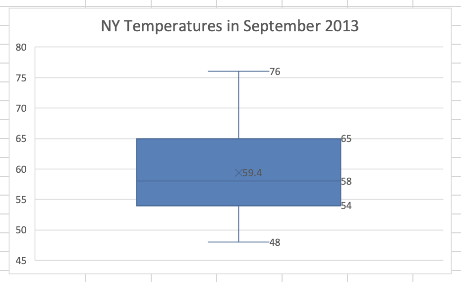

# Box and Whisker Plot

*Quartiles* are quantiles (also percentiles) that divide the data into approximately four equal parts.

A *box and whisker plot* is a graph showing the data distribution using the *five-number-summary*: minimum value, first quartile, median (second quartile), third quartile, and maximum value. This type of graph is also known as a box plot.

The *interquartile range* (*IQR*) represents the spread of the middle half of the data and is calculated as the difference between the third and first quartiles.

## Preparation

In this lab, you will use a data set containing NY temperatures in September of 2013. 

Download the data set called *Lab 8 NY Temp Sept2013.xlsx* from here [**https://github.com/bsosnovski/Intro-Stats-Excel-Lab-Manual/blob/main/Data_Sets/Lab-8-NY-Temp-Sept2013.xlsx**](https://github.com/bsosnovski/Intro-Stats-Excel-Lab-Manual/blob/main/Data_Sets/Lab-8-NY-Temp-Sept2013.xlsx). 

Open the Excel file *Lab 8 NY Temp Sept2013.xlsx* and follow the instructions below.

## Five-Number-Summary

Using Excel, you will compute the five-number summary, generate a box plot, and compute the interquartile range (IQR) for *Lab 8 NY temperatures in the September 2013* workbook.

Use Excel to compute the following in an empty part of the worksheet.

1. Choose a cell and type *Min*, and in the cell next to it, enter `= MIN(B3:B32)` to find the minimum value of the data set.
2. Below *Min*, type *Q1*, and in the cell next to it, enter `= QUARTILE(B3:B32,1)` to find the first quartile. 
3. Below *Q1*, type *Q2*, and in the cell next to it, enter `= QUARTILE(B3:B32,2)` to find the second quartile.
4. Below *Q2*, type *Q3*, and in the cell next to it, enter `= QUARTILE(B3:B32,3)` to find the third quartile.
5, Below *Q3*, type *Max*, and in the cell next to it, enter `= Max(B3:B32)` to find the maximum value of the data set. 
6. Below *Max*, type *Median*, and enter `= MEDIAN(B3:B32)` next to it to compute the median.

Be sure that your five-number summary is organized to display the results. For example:

<center>
```{r, echo= FALSE, fig.align="center"}
Measures <- c('Min', 'Q1', 'Q2', 'Q3', 'Max', 'Median')
Values <- c(18, 24.50, 38, 44.25, 58, 38)
df <- data.frame(Measures,Values)
knitr::kable(df,
  caption = 'Example of a five-number-summary', col.names = NULL, format = "html", table.attr = "style='width:50%;'" )
```
<center>

**Note:**  The five-number summary for the NY Temperatures will differ from those shown in Table 1.

## The Interquartile Range

Using Excel compute the *IQR* of the data set. Recall that the formula for *IQR* is `IQR = Q3 - Q1`.

Use an Excel formula to calculate the *IQR*. Your formula must use cell addresses in the calculation. Place your formula in empty cells below your five-number summary.

## Box Plot
1. Select the cells with the temperature values in Column B.
2. Go to the Insert tab. Select `Box and Whisker` in the `Charts` ribbon (Figure **\@ref(fig:box-and-whisker-menu)**).

```{r box-and-whisker-menu, echo=FALSE, fig.align = 'center', out.width='45%', fig.show='hold', fig.cap='Box and Whisker option in the Chart ribbon of the Insert tab.', fig.alt = 'A screenshot of the Box and Whisker option in Chart ribbon of the Insert tab.'}

```

The resulting plot is shown in Figure **\@ref(fig:box-and-whisker-plot)**. 

```{r box-and-whisker-plot, echo=FALSE, fig.align = 'center', out.width='55%', fig.show='hold', fig.cap='Box and Whisker created.', fig.alt = 'A screenshot of  the Box and Whisker created.'}

```
 
3. Replace *Chart Title* with *NY Temperatures in September 2013*.
4. `RIGHT-click` on the vertical axis and then select `Format Axis` to change the axis format in the graph. Set the *Minimum Bound* as 45. Adjusting the axis removes the unnecessary space in the chart.

```{r format-axis, echo=FALSE, fig.align = 'center', out.width='35%', fig.show='hold', fig.cap='Format Axis options.', fig.alt = 'A screenshot of the Format Axis options.'}

```
 
Use the `Chart Design` to customize the look of your chart.

5. Select the graph, and the tab `Chart Design` appears in the menu. Click on the `Chart Design` tab.
6. Click `Add Chart Element > Data Labels > Right`.
7. Click `Add Chart Element > Axes`. Uncheck the option `Primary Horizontal`.

The adjusted box plot is shown in Figure **\@ref(fig:final-box-plot)**.

```{r final-box-plot, echo=FALSE, fig.align = 'center', out.width='55%', fig.show='hold', fig.cap='Adjusted box plot.', fig.alt = 'Adjusted box plot.'}

```

## Practice

Use Excel to generate the five-number-summary, *IQR*, and box plot for the financial data you collected for *Lab* ***\@ref(time-series)*** *Time Series and Measures of Central Tendency*.
