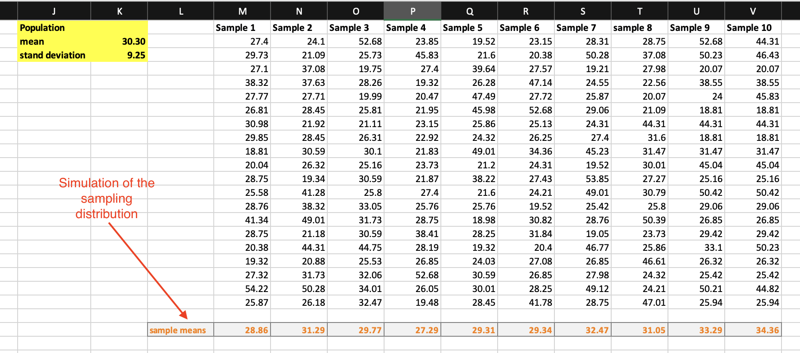

# The Central Limit Theorem

The *sampling distribution* of sample means is a distribution formed by means of all samples of size $n$ repeatedly taken from a population. If a population has mean $\mu$ and standard deviation $\sigma$, and all possible samples of size $n$ are taken from the population then sampling distribution satisfies the following properties $\mu_{\bar{x}}=\mu$ and $\sigma_{\bar{x}}=\sigma/\sqrt{n}$.

The *Central Limit Theorem* states that the sampling distribution of sample means approaches a normal distribution as the sample size gets larger no matter the population distribution's shape. This is especially true for sample sizes over 30. The greater the sample size, the better the approximation. 

If the population itself is normally distributed, then the sampling distribution of sample means is normally distributed for any sample size $n$.

In this lab, you will simulate the sampling distribution by generating some of the samples of a specific size and comparing the results with the theoretical values for actual sampling distribution.

## Preparation

You will use the *Lab 12 FB Daily.xlsx* that contains some of the daily Facebook stock prices.

Download the data set from here [**https://github.com/bsosnovski/Intro-Stats-Excel-Lab-Manual/blob/main/Data_Sets/Lab-12-FB-Daily.xlsx**](https://github.com/bsosnovski/Intro-Stats-Excel-Lab-Manual/blob/main/Data_Sets/Lab-12-FB-Daily.xlsx). 

Open the Excel file *Lab 12 FB Daily.xlsx* and follow the instructions below.

## Mean and Standard Deviation of the Population {#mean-stdev-population}

Assume that the data contains all the *Close Prices* of the FB stocks (it is data from a population). You will calculate the mean and standard deviation of the populations of FB *Close Prices*.

1. Go to an empty column in the *Lab 12 FB Daily* worksheet, and type the label *Population*, *Mean* and *Stand Dev* in separate cells.
2. Select the cell next to the cell *Mean* and enter the formula `= AVERAGE(F2:F389)` to compute the mean.
3. Select the cell next to the cell *Stand Dev* and enter `= STDEV.P(F2:F389)` to compute the data’s standard deviation of the population.
4. Adjust the mean and standard deviation values to two (2) decimal places.

## Generating Random Samples

You will simulate the sampling distribution by generating only 10 random samples of *Close Prices* with a sample size equal to 20. 

1. Go to an empty column and type the label *Sample 1*. 
2. Below *Sample 1*, click `Data > Data Analysis > Sampling`. 
3. Click `OK`.
4. In the window that appears, enter the following:
    * Input Range: Select cells `F2:F389`. 
    * Sample method: Check `Random`.
      - Number of Samples: `20`.
    * Output Options: Click `Output Range`.
      - Select below *Sample 1* to paste the sample created..
5. Click `OK`.
6. Repeat the process for *Sample 2* through *Sample 10*. 

```{r data-analysis-sampling, echo=FALSE, fig.align = 'center', out.width='75%', fig.show='hold', fig.cap='Sampling window in Data Analysis ribbon', fig.alt = 'A screenshot of the sampling window in Data Analysis ribbon.'}
knitr::include_graphics('images/data-analysis-sampling.png')
```

## Sample Means {#mean-samples}

Now you will calculate the mean for each sample you generated.

1. For each sample, place its sample mean below the column that contains the sample (use a similar formula to the one in *Section* ***\@ref(mean-stdev-population)*** *Mean and Standard Deviation of the Population*).
2. Highlight the results to distinguish them from the values in the sample.

```{r simualation-sampling-distribution, echo=FALSE, fig.align = 'center', out.width='100%', fig.show='hold', fig.cap='An example of the sampling mean distribution generated.', fig.alt = 'A screenshot of an example of the sampling mean distribution generated.'}

```

## The Mean and Standard Deviation of the Sampling Distribution

1. After *Section* ***\@ref(mean-samples)*** above, all the ten (10) sample means should be on the same row (Figure **\@ref(fig:simualation-sampling-distribution)**). From these sample means calculate the mean and standard deviation (use  `STDEV.S`) for the FB *Close Prices* in an empty part of the worksheet.

2. Calculate the population standard deviation value in *Section* ***\@ref(mean-stdev-population)*** divided by $\sqrt{20}$ (square root of the sample size).
	
Recall that the theoretical value of generating all the samples of size 20 should be $\mu_{\bar{x}}=\mu$ and $\sigma_{\bar{x}}=\sigma/\sqrt{n}$. Compare the results in Step 1 with the results obtained in Step 2. 

## Practice

1. Repeat the process above with 10 samples of size 50 for the FB *Close Prices*.
2. Repeat the process above with 20 samples of size 50 for the FB *Open Prices*.

